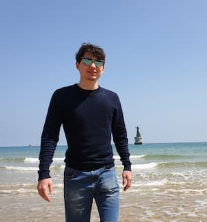

+++
title = 'About'
description = 'About mrdotb'
+++

## Hi there

My name is Baptiste Chaleil also known as mrdotb. I live in Paris, France.

I am a freelance developer specialized in development of web applications with Elixir. I love to develop. I care about UX, responsiveness, performance, maintainability and scalability.

When I am not working I like to travel around the world or tinker my [~dotfiles](https://github.com/mrdotb/dotfiles).

I maintain some open-source projects on [github](https://github.com/mrdotb/) and answers questions occasionally on [stack overflow](https://stackoverflow.com/users/3343266/mrdotb) and [elixir forum](https://elixirforum.com/u/mrdotb/summary).

My linux distributions of choice are [Pop!_OS](https://pop.system76.com/) for my development environment and [ubuntu](https://ubuntu.com/) for my servers.

Currently looking for new contract.
[Contact me](mailto:baptiste.chaleil@protonmail.com)
