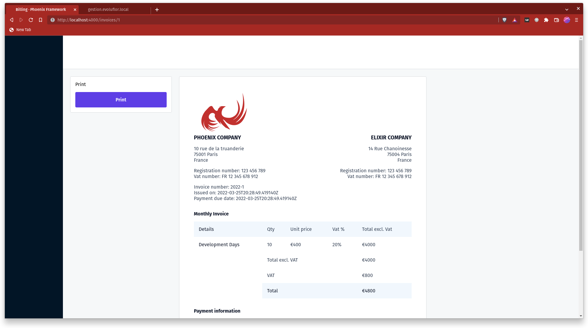
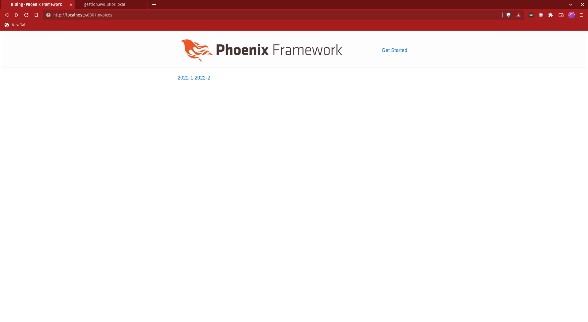

+++
title = 'Render beautiful pdf invoice with phoenix and pagedjs'
date = '2022-03-25T13:50:53+01:00'
author = 'mrdotb'
description = 'How to render a beautiful paginated pdf invoice with phoenix and pagedjs'
tags = ['elixir', 'phoenix', 'pagedjs', 'pdf']
toc = true
showReadingTime = true
+++

## Intro

In this blog post, using [phoenix](https://www.phoenixframework.org/) and [pagedjs](https://pagedjs.org/) we are going to render invoice in pdf format.

How it's going to look like with the UI and the pdf preview.
[](./2-screenshot-page.png)
[This invoice printed in pdf ](./1-invoice-sample.pdf)

## What is pagedjs ?

[Paged.js](https://pagedjs.org/) is a free and open source JavaScript library that paginates content in the browser to create PDF output from any HTML content. This means you can design works for print (eg. books) using HTML and CSS!

## Show me the code!

You can check the final [repo](https://github.com/mrdotb/billing) on github.

## Step 1: Create a new Phoenix project an install dependencies

Install the Phoenix project generator (if you don't already have it installed) by running:

```bash
mix archive.install hex phx_new 1.6.6
```

Now we can generate a new Phoenix project. I disable a lot of generator features because it's not needed here.

```bash
mix phx.new --no-ecto --no-gettext --no-dashboard --no-live --no-mailer billing
```

Don't forget to fetch the deps `mix deps.get`

## Step 2: Create the invoice model

With your editor of choice create a new file called `lib/billing/invoice.ex`.

We create a struct `Invoice` `Article` `Total` `PaymentInformation` who will hold all the data necessary to render the invoice.
We could use a simple map as well but it helps to modelize the data properly.
I found it easier to make the view and less prone to key error.

```elixir
defmodule Billing.Invoice do
  defstruct ~w(
    id
    title
    number
    seller
    client
    issued_on
    payment_due_date
    articles
    total
    payment_information
  )a

  @type t :: %__MODULE__{
          id: pos_integer(),
          title: String.t(),
          number: String.t(),
          seller: Company.t(),
          client: Company.t(),
          issued_on: DateTime.t(),
          payment_due_date: DateTime.t(),
          number: String.t(),
          articles: [Article.t()],
          total: Total.t(),
          payment_information: PaymentInformation.t()
        }

  defmodule Company do
    defstruct ~w(
      name
      logo
      address
      zip_code
      city
      country
      registration_number
      vat_number
    )a

    @type t :: %__MODULE__{
            name: String.t(),
            logo: String.t(),
            address: String.t(),
            zip_code: String.t(),
            city: String.t(),
            country: String.t(),
            registration_number: String.t(),
            vat_number: String.t()
          }
  end

  defmodule Article do
    defstruct ~w(
      details
      qty
      unit_price
      vat
      total_excl_vat
      total
    )a

    @type t :: %__MODULE__{
            details: String.t(),
            qty: integer(),
            # I recommand using https://hexdocs.pm/decimal or
            # https://hexdocs.pm/money in a real project
            unit_price: float(),
            vat: float(),
            total_excl_vat: float(),
            total: float()
          }
  end

  defmodule Total do
    defstruct ~w(
      total_excl_vat
      vat_amount
      total
    )a

    @type t :: %__MODULE__{
            # I recommand using https://hexdocs.pm/decimal or
            # https://hexdocs.pm/money in a real project
            total_excl_vat: float(),
            vat_amount: float(),
            total: float()
          }
  end

  defmodule PaymentInformation do
    defstruct ~w(
      bic
      iban
      reference
    )a

    @type t :: %__MODULE__{
            bic: String.t(),
            iban: String.t(),
            reference: String.t()
          }
  end
end
```

## Step 3: Setup the Billing context with fake data

The context Billing is responsable to retrieve a list of invoice `list_invoices` and get them per id `get_invoice(invoice_id)`.
We also put some fake data directly in the context.

```elixir
defmodule Billing do
  alias Billing.Invoice
  alias Billing.Invoice.{Company, Article, Total, PaymentInformation}

  def list_invoices do
    invoices()
  end

  def get_invoice(id) do
    Enum.find(list_invoices(), &(&1.id == id))
  end

  # Fake invoices
  defp invoices do
    now = DateTime.utc_now()
    %{year: year} = now
    in_30_days = DateTime.add(now, 24 * 3600 * 30, :second)

    [
      %Invoice{
        id: 1,
        title: "Monthly Invoice",
        seller: phoenix_company(),
        client: elixir_company(),
        issued_on: now,
        payment_due_date: in_30_days,
        number: "#{year}-1",
        articles: [
          %Article{
            details: "Dev Day",
            qty: 10,
            unit_price: 400,
            vat: 20,
            total_excl_vat: 4000,
            total: 4800
          }
        ],
        total: %Total{
          total_excl_vat: 4000,
          vat_amount: 800,
          total: 4800
        },
        payment_information: payment_information()
      },
      %Invoice{
        id: 2,
        title: "Monthly Invoice",
        seller: phoenix_company(),
        client: elixir_company(),
        issued_on: now,
        payment_due_date: in_30_days,
        number: "#{year}-2",
        articles: Enum.map(~w(Jose Bob Michael Baptiste), fn developer ->
          %Article{
            details: "Dev days for #{developer}",
            qty: 10,
            unit_price: 400,
            vat: 20,
            total_excl_vat: 4000,
            total: 4800
          }
        end),
        total: %Total{
          total_excl_vat: 4000 * 4,
          vat_amount: 800 * 4,
          total: 4800 * 4
        },
        payment_information: payment_information()
      }
    ]
  end

  defp phoenix_company do
    %Company{
      name: "Phoenix Company",
      logo: "/logo.png",
      address: "10 rue de la truanderie",
      zip_code: "75001",
      city: "Paris",
      country: "France",
      registration_number: "123 456 789",
      vat_number: "FR 12 345 678 912"
    }
  end

  defp elixir_company do
    %Company{
      name: "Elixir Company",
      logo: nil,
      address: "14 Rue Chanoinesse",
      zip_code: "75004",
      city: "Paris",
      country: "France",
      registration_number: "123 456 789",
      vat_number: "FR 12 345 678 912"
    }
  end

  defp payment_information do
    %PaymentInformation{
      bic: "TRZ0FR12345",
      iban: "FR76 1234 5678 9123 4567 8912",
      reference: "sl432432"
    }
  end
end
```

## Step 4: Add pagedjs to vendor

We need to dowload pagedjs and add it to our vendor.

```bash
curl https://unpkg.com/pagedjs@0.2.0/dist/paged.js --output assets/vendor/paged.js
```

You can also use npm if you prefer the name of the package is ... `pagedjs`

## Step 5: Create the pdf layout

We only want to load pagedjs on the page where we will show our pdf preview, we are going to create a js file and a css that will only be called if the root pdf layout is used.
We also need a small ui that will wrap the pdf preview generated by pagedjs.

Create a root layout file `lib/billing_web/templates/layout/pdf.html.heex`.

```elixir
<!DOCTYPE html>
<html lang="en">
  <head>
    <meta charset="UTF-8">
    <meta http-equiv="X-UA-Compatible" content="IE=edge"/>
    <meta name="viewport" content="width=device-width, initial-scale=1.0">
    <%= live_title_tag assigns[:page_title] || "Billing", suffix: " · Phoenix Framework" %>
    <link phx-track-static rel="stylesheet" href={Routes.static_path(@conn, "/assets/pdf.css")}/>
    <script defer phx-track-static type="text/javascript" src={Routes.static_path(@conn, "/assets/pdf.js")}></script>
  </head>
  <body>
    <div id="layout" class="layout">
      <aside id="aside"></aside>
      <main>
        <header id="header"></header>
        <div id="grid" class="grid">
          <div id="menu" class="menu">
            <div id="block" class="block">
              <div>Print</div>
              <div class="button-print">Print</div>
            </div>
          </div>
          <div id="preview"></div>
        </div>
      </main>
    </div>
    <div id="root">
      <%= @inner_content %>
    </div>
  </body>
</html>
```

## Step 6: Create the pdf.js and pdf.css and add it to esbuild

Create the file `assets/js/pdf.js`

```javascript
// We import the CSS which is extracted to its own file by esbuild.
// Remove this line if you add a your own CSS build pipeline (e.g postcss).
import "../css/pdf.css"

// Adapt the import if you use npm
import {Previewer} from '../vendor/paged.js';

const previewer = new Previewer();
const html = document.querySelector('#root').innerHTML;
const $preview = document.querySelector('#preview');

// pagedjs will take the content we put in #root html variable
// and will paginate it nicely in a4 format if it does not fit in one page
// we can get a preview in html format and put it in the dom node $preview variable
previewer.preview(html, ['/assets/pdf.css'], $preview);

// add a click event on print button to ... print
document.querySelector('.button-print').addEventListener('click', _e => window.print())
```

Create the file `assets/css/pdf.css`
```css
body {
  font-family: ui-sans-serif, system-ui, -apple-system, BlinkMacSystemFont, "Segoe UI", Roboto, "Helvetica Neue", Arial, "Noto Sans", sans-serif, "Apple Color Emoji", "Segoe UI Emoji", "Segoe UI Symbol", "Noto Color Emoji";
  background: #f6f8f9;
  padding: 0;
  margin: 0;
}

@page {
  margin: 0.5in 0.5in;

  @bottom-right {
    /* format the page number */
    content: "Page " counter(page) " of " counter(pages);
    font-size: 9px;
    color: #606d78;
  }
}

/* important class we use to force a new page */
.no-break {
  break-inside: avoid;
}

/* preview UI style */
#root {
  display: none;
}

#layout {
  display: flex;
}

#aside {
  width: 192px;
  flex: 0 0 192px;
  background: #011627;
  min-height: 100vh;
}

#header {
  background: #fff;
  height: 110px;
  border-bottom: 1px solid #d6d9dc;
}

main {
  flex: 1 1;
}

#grid {
  display: table;
  border-collapse: collapse;
  border: 0;
}

#menu {
  display: table-cell;
  position: relative;
  width: 360px;
  border: 0;
}

#block {
  box-sizing: border-box;
  position: sticky;
  top: 1.5rem;
  background: #fff;
  border: 1px solid #d6d9dc;
  margin: 1.5rem;
  margin-right: 0;
  border-radius: 4px;
  padding: 1rem;
}

.button-print {
  cursor: pointer;
  box-sizing: border-box;
  width: 100%;
  background: #5541ea;
  color: #fff;
  border-radius: 4px;
  padding: 1rem;
  font-weight: 600;
  text-align: center;
  margin-top: 1rem;
}

#preview {
  display: table-cell;
  vertical-align: top;
  border: 0;
  padding: 0;
  margin: 0;
}

@media print {
  #root,
  #aside,
  #header,
  #menu {
    display: none;
  }
  #preview {
    display: block;
  }
  #preview .pagedjs_page {
    border: initial !important;
    border-radius: 0 !important;
  }
}

.pagedjs_page {
  background: white;
  border: 1px solid #d6d9dc;
  border-radius: 4px;
  margin: 1.5rem;
}

/* utility class used for the invoice */
.grid-2 {
  display: grid;
  grid-template-columns: 1fr 1fr;
  column-gap: 1rem;
}

.uppercase {
  text-transform: uppercase;
}

.text-lg {
  font-size: 1.125rem;
}

.text-right {
  text-align: right;
}

.text-slate-500 {
  color: rgb(51 65 85);
}

.text-slate-900 {
  color: rgb(15 23 42);
}

.font-bold {
  font-weight: 700;
}

.mt-4 {
  margin-top: 1rem;
}

.p-4 {
  padding: 1rem;
}

.mt-8 {
  margin-top: 2rem;
}

.bg-logo {
  /* We need to set this property otherwise the backgroundColor dissapear on pdf more info on the link below
   * https://stackoverflow.com/questions/14987496/background-color-not-showing-in-print-preview
   * */
  -webkit-print-color-adjust: exact; 
  background-size: contain;
  background-repeat: no-repeat;
  width: 200px;
  height: 143px;
}

.bg-lightblue {
  background-color: rgb(241 247 253);
  /* We need to set this property otherwise the backgroundColor dissapear on pdf more info on the link below
   * https://stackoverflow.com/questions/14987496/background-color-not-showing-in-print-preview
   * */
  -webkit-print-color-adjust: exact; 
}

.table {
  border-collapse: collapse;
  table-layout: auto;
  width: 100%;
}

.table td {
  padding: 1rem;
}
```


Let's add `pdf.js` to our esbuild config. I also upgraded the target to `es2021` pagedjs does not work target less that `es2018`

```elixir
config :esbuild,
  version: "0.14.0",
  default: [
    args:
      ~w(js/app.js js/pdf.js --bundle --target=es2021 --outdir=../priv/static/assets --external:/fonts/* --external:/images/*),
    cd: Path.expand("../assets", __DIR__),
    env: %{"NODE_PATH" => Path.expand("../deps", __DIR__)}
  ]
```

## Step 7: Create the Controller, view, templates and routes

We will have two routes `/invoices` who will list all the invoices and `/invoices/:invoice_id` who will render the invoice pdf preview per `invoice_id`.

Create the controller file `lib/billing_web/controllers/invoice_controller.ex`.

```elixir
defmodule BillingWeb.InvoiceController do
  use BillingWeb, :controller

  def index(conn, _params) do
    invoices = Billing.list_invoices()
    render(conn, "index.html", invoices: invoices)
  end

  def show(conn, %{"invoice_id" => invoice_id}) do
    invoice =
      invoice_id
      |> String.to_integer()
      |> Billing.get_invoice()

    render(conn, "show.html", invoice: invoice)
  end
end
```

Create the view file `lib/billing_web/views/invoice_view.ex`

```elixir
defmodule BillingWeb.InvoiceView do
  use BillingWeb, :view
end
```

Create a directory `lib/billing_web/templates/invoice`

Create a file `lib/billing_web/templates/invoice/index.html.heex`
We simply list all the `@invoices` and generate link to them.

```elixir
<%= for invoice <- @invoices do %>
  <%= link(invoice.number, to: Routes.invoice_path(@conn, :show, invoice.id)) %>
<% end %>
```
Create a file `lib/billing_web/templates/invoice/show.html.heex` leave it empty we will come back on it.

Edit `lib/billing_web/router.ex`

```elixir
defmodule BillingWeb.Router do
  use BillingWeb, :router

  pipeline :browser do
    plug :accepts, ["html"]
    plug :fetch_session
    plug :fetch_live_flash
    plug :put_root_layout, {BillingWeb.LayoutView, :root}
    plug :protect_from_forgery
    plug :put_secure_browser_headers
  end

  pipeline :pdf do
    # We use our root layout pdf instead of root
    plug :put_root_layout, {BillingWeb.LayoutView, :pdf}
    # We don't need a layout
    plug :put_layout, false
  end

  scope "/", BillingWeb do
    pipe_through [:browser]

    get "/invoices", InvoiceController, :index
  end

  scope "/", BillingWeb do
    pipe_through [:browser, :pdf]

    # this route will use our root layout pdf and require our pdf.js and pdf.css
    get "/invoices/:invoice_id", InvoiceController, :show
  end
end
```

After this point you should be able to go to `/invoices` and see our list of invoices.
[](./3-screenshot-page.png)

You can click on one of them but the preview will be empty until we finish last step.


## Step 8: Write the show invoice 

Edit `lib/billing_web/templates/invoice/show.html.heex`
Here we are consuming the `@invoice` data and make it look nice using our utility class.
```elixir
<div class="grid-2">
  <div>
    <% logo = Routes.static_path(@conn, "/images/#{@invoice.seller.logo}") %>
    <% bg_logo = "background-image: url(#{logo})" %>
    <div class="bg-logo" style={bg_logo}></div>
    <div class="uppercase text-lg font-bold text-slate-900"><%= @invoice.seller.name %></div>
    <div class="text-slate-500 mt-4">
      <div><%= @invoice.seller.address %></div>
      <div><%= @invoice.seller.zip_code %> <%= @invoice.seller.city %></div>
      <div><%= @invoice.seller.country %></div>
    </div>
    <div class="text-slate-500 mt-4">
      <div>Registration number: <%= @invoice.seller.registration_number %></div>
      <div>Vat number: <%= @invoice.seller.vat_number %></div>
    </div>
    <div class="text-slate-500 mt-4">
      <div>Invoice number: <%= @invoice.number %></div>
      <div>Issued on: <%= @invoice.issued_on %></div>
      <div>Payment due date: <%= @invoice.issued_on %></div>
    </div>
  </div>

  <div class="text-right">
    <div class="bg-logo"></div>
    <div class="uppercase text-lg font-bold text-slate-900"><%= @invoice.client.name %></div>
    <div class="text-slate-500 mt-4">
      <div><%= @invoice.client.address %></div>
      <div><%= @invoice.client.zip_code %> <%= @invoice.client.city %></div>
      <div><%= @invoice.client.country %></div>
    </div>
    <div class="text-slate-500 mt-4">
      <div>Registration number: <%= @invoice.client.registration_number %></div>
      <div>Vat number: <%= @invoice.client.vat_number %></div>
    </div>
  </div>
</div>

<%# wrapping content with a no-break class prevent the content to break on multiples pages %> 
<div class="no-break">
  <div class="mt-8 text-slate-900 font-bold"><%= @invoice.title %></div>
  <table class="mt-4 table text-slate-500">
    <thead class="bg-lightblue">
      <tr>
        <td class="bold text-slate-900">Details</td>
        <td>Qty</td>
        <td>Unit price</td>
        <td>Vat %</td>
        <td>Total excl. Vat</td>
      </tr>
    </thead>
    <tbody>
      <%= for article <- @invoice.articles do %>
        <tr>
          <td class="text-slate-900"><%= article.details %></td>
          <td><%= article.qty %></td>
          <td>€<%= article.unit_price %></td>
          <td><%= article.vat %>%</td>
          <td>€<%= article.total_excl_vat %></td>
        </tr>
      <% end %>
      <tr>
        <td></td>
        <td colspan="3">Total excl. VAT</td>
        <td>€<%= @invoice.total.total_excl_vat %></td>
      </tr>
      <tr>
        <td></td>
        <td colspan="3">VAT</td>
        <td>€<%= @invoice.total.vat_amount %></td>
      </tr>
      <tr class="bold text-slate-900">
        <td></td>
        <td class="bg-lightblue" colspan="3">Total</td>
        <td class="bg-lightblue">€<%= @invoice.total.total %></td>
      </tr>
    </tbody>
  </table>
</div>

<div class="no-break">
  <div class="mt-8 text-slate-900 font-bold">Payment information</div>
  <div class="mt-4 text-slate-500">
    <div>BIC: <%= @invoice.payment_information.bic %></div>
    <div>IBAN: <%= @invoice.payment_information.iban %></div>
    <div>Reference: <%= @invoice.payment_information.reference %></div>
    <div>To use as a label on your bank transfer to identify the transaction</div>
    <div class="mt-4 bg-lightblue p-4">
      Payment possible by SEPA transfer only, SWIFT transfers are not accepted.
    </div>
  </div>
</div>
```

## Ending

Well done you reach the end 🎉. I hope you enjoyed this tutorial and learned some stuff along the way.

Feel free to leave comments or feedback.
I plan to write a part 2 on how to generate the pdf server side with [chromic_pdf](https://hexdocs.pm/chromic_pdf/readme.html) and mail it if some peoples are interested.
